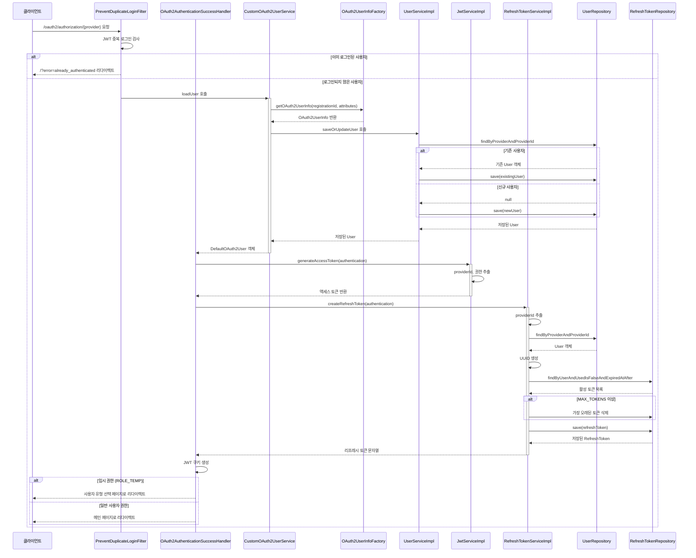

# AIBE1-Project2-Team05-frontend

```mermaid
sequenceDiagram
    participant Client as 클라이언트 #0063B2
    participant Filter as PreventDuplicateLoginFilter #4CAF50
    participant Success as OAuth2AuthenticationSuccessHandler #FF9800
    participant OAuth2Service as CustomOAuth2UserService #673AB7
    participant Strategy as OAuth2UserInfoFactory #03A9F4
    participant UserService as UserServiceImpl #FF5722
    participant Jwt as JwtServiceImpl #9C27B0
    participant RT as RefreshTokenServiceImpl #8BC34A
    participant UserRepo as UserRepository #3F51B5
    participant RTRepo as RefreshTokenRepository #E91E63

    Client->>Filter: /oauth2/authorization/{provider} 요청
    Filter->>Filter: JWT 중복 로그인 검사

    alt 이미 로그인된 사용자
        Filter-->>Client: /?error=already_authenticated 리다이렉트
    else 로그인되지 않은 사용자
        Filter->>+OAuth2Service: loadUser 호출
        OAuth2Service->>Strategy: getOAuth2UserInfo(registrationId, attributes)
        Strategy-->>OAuth2Service: OAuth2UserInfo 반환

        OAuth2Service->>UserService: saveOrUpdateUser 호출
        UserService->>UserRepo: findByProviderAndProviderId

        alt 기존 사용자
            UserRepo-->>UserService: 기존 User 객체
            UserService->>UserRepo: save(existingUser)
        else 신규 사용자
            UserRepo-->>UserService: null
            UserService->>UserRepo: save(newUser)
        end

        UserRepo-->>UserService: 저장된 User
        UserService-->>OAuth2Service: 저장된 User
        OAuth2Service-->>-Success: DefaultOAuth2User 객체

        Success->>+Jwt: generateAccessToken(authentication)
        Jwt->>Jwt: providerId, 권한 추출
        Jwt-->>-Success: 액세스 토큰 반환

        Success->>+RT: createRefreshToken(authentication)
        RT->>RT: providerId 추출
        RT->>UserRepo: findByProviderAndProviderId
        UserRepo-->>RT: User 객체

        RT->>RT: UUID 생성
        RT->>RTRepo: findByUserAndUsedIsFalseAndExpiredAtAfter
        RTRepo-->>RT: 활성 토큰 목록

        alt MAX_TOKENS 이상
            RT->>RTRepo: 가장 오래된 토큰 삭제
        end

        RT->>RTRepo: save(refreshToken)
        RTRepo-->>RT: 저장된 RefreshToken
        RT-->>-Success: 리프레시 토큰 문자열

        Success->>Success: JWT 쿠키 생성

        alt 임시 권한 (ROLE_TEMP)
            Success-->>Client: 사용자 유형 선택 페이지로 리다이렉트
        else 일반 사용자 권한
            Success-->>Client: 메인 페이지로 리다이렉트
        end
    end
```
