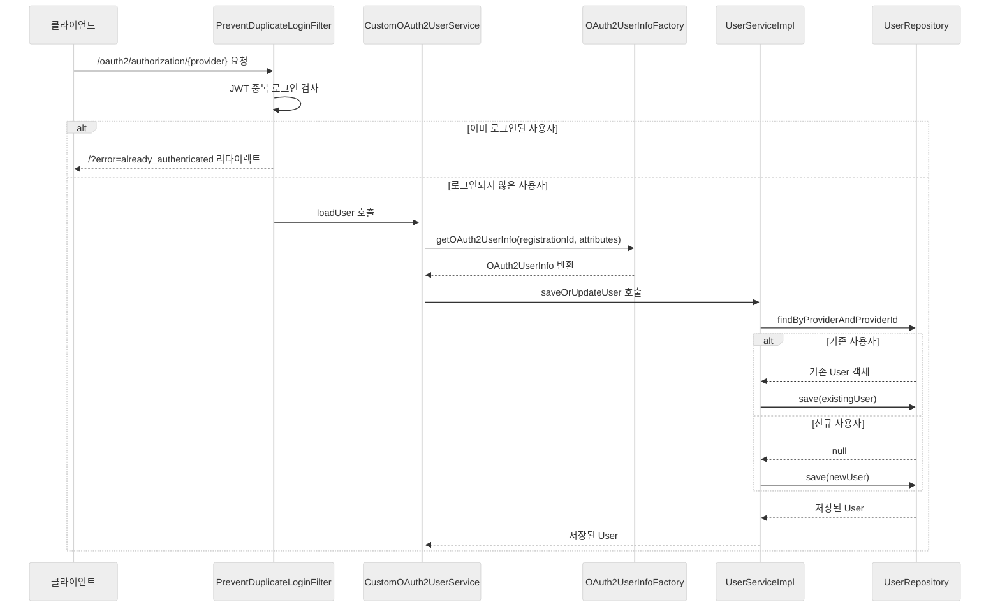
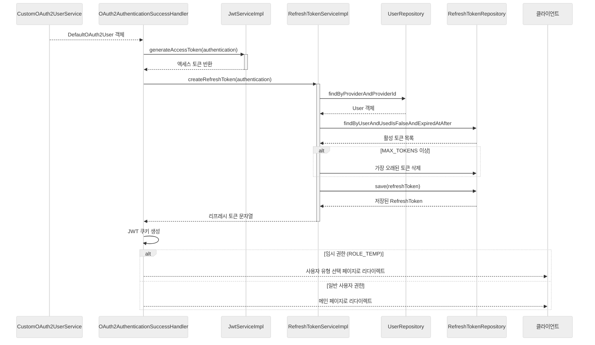
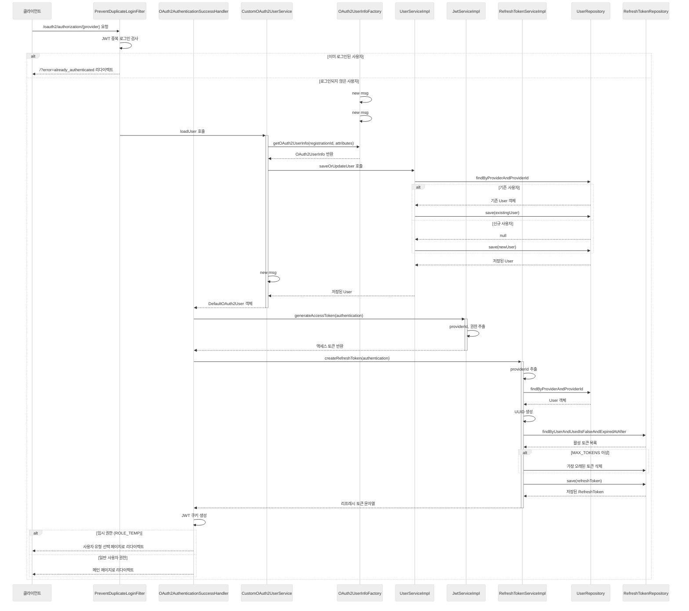

# AIBE1-Project2-Team05-frontend

## 인증 요청 → 사용자 조회/저장

```mermaid
---
config:
  theme: neutral 
---
sequenceDiagram
  participant Client as 클라이언트
  participant Filter as PreventDuplicateLoginFilter
  participant OAuth2Service as CustomOAuth2UserService
  participant Strategy as OAuth2UserInfoFactory
  participant UserService as UserServiceImpl
  participant UserRepo as UserRepository

  Client ->> Filter: /oauth2/authorization/{provider} 요청
  Filter ->> Filter: JWT 중복 로그인 검사

  alt 이미 로그인된 사용자
    Filter -->> Client: /?error=already_authenticated 리다이렉트
  else 로그인되지 않은 사용자
    Filter ->>+ OAuth2Service: loadUser 호출
    OAuth2Service ->> Strategy: getOAuth2UserInfo(registrationId, attributes)
    Strategy -->> OAuth2Service: OAuth2UserInfo 반환

    OAuth2Service ->> UserService: saveOrUpdateUser 호출
    UserService ->> UserRepo: findByProviderAndProviderId

    alt 기존 사용자
      UserRepo -->> UserService: 기존 User 객체
      UserService ->> UserRepo: save(existingUser)
    else 신규 사용자
      UserRepo -->> UserService: null
      UserService ->> UserRepo: save(newUser)
    end

    UserRepo -->> UserService: 저장된 User
    UserService -->> OAuth2Service: 저장된 User
  end
```

## 토큰 발급 → 리다이렉트

```mermaid
---
config:
  theme: neutral 
---
sequenceDiagram
  participant OAuth2Service as CustomOAuth2UserService
  participant Success as OAuth2AuthenticationSuccessHandler
  participant Jwt as JwtServiceImpl
  participant RT as RefreshTokenServiceImpl
  participant UserRepo as UserRepository
  participant RTRepo as RefreshTokenRepository
  participant Client as 클라이언트

  OAuth2Service -->> Success: DefaultOAuth2User 객체
  Success ->>+ Jwt: generateAccessToken(authentication)
  Jwt -->>- Success: 액세스 토큰 반환

  Success ->>+ RT: createRefreshToken(authentication)
  RT ->> UserRepo: findByProviderAndProviderId
  UserRepo -->> RT: User 객체
  RT ->> RTRepo: findByUserAndUsedIsFalseAndExpiredAtAfter
  RTRepo -->> RT: 활성 토큰 목록

  alt MAX_TOKENS 이상
    RT ->> RTRepo: 가장 오래된 토큰 삭제
  end

  RT ->> RTRepo: save(refreshToken)
  RTRepo -->> RT: 저장된 RefreshToken
  RT -->>- Success: 리프레시 토큰 문자열

  Success ->> Success: JWT 쿠키 생성

  alt 임시 권한 (ROLE_TEMP)
    Success -->> Client: 사용자 유형 선택 페이지로 리다이렉트
  else 일반 사용자 권한
    Success -->> Client: 메인 페이지로 리다이렉트
  end

```

## 풀버전

```mermaid
---
config:
  theme: neutral 
---
sequenceDiagram
  participant Client as 클라이언트
  participant Filter as PreventDuplicateLoginFilter
  participant Success as OAuth2AuthenticationSuccessHandler
  participant OAuth2Service as CustomOAuth2UserService
  participant Strategy as OAuth2UserInfoFactory
  participant UserService as UserServiceImpl
  participant Jwt as JwtServiceImpl
  participant RT as RefreshTokenServiceImpl
  participant UserRepo as UserRepository
  participant RTRepo as RefreshTokenRepository
  Client ->> Filter: /oauth2/authorization/{provider} 요청
  Filter ->> Filter: JWT 중복 로그인 검사
  alt 이미 로그인된 사용자
    Filter -->> Client: /?error=already_authenticated 리다이렉트
  else 로그인되지 않은 사용자
    Strategy ->> Strategy: new msg
    Strategy ->> Strategy: new msg
    Filter ->>+ OAuth2Service: loadUser 호출
    OAuth2Service ->> Strategy: getOAuth2UserInfo(registrationId, attributes)
    Strategy -->> OAuth2Service: OAuth2UserInfo 반환
    OAuth2Service ->> UserService: saveOrUpdateUser 호출
    UserService ->> UserRepo: findByProviderAndProviderId
    alt 기존 사용자
      UserRepo -->> UserService: 기존 User 객체
      UserService ->> UserRepo: save(existingUser)
    else 신규 사용자
      UserRepo -->> UserService: null
      UserService ->> UserRepo: save(newUser)
    end
    UserRepo -->> UserService: 저장된 User
    OAuth2Service ->> OAuth2Service: new msg
    UserService -->> OAuth2Service: 저장된 User
    OAuth2Service -->>- Success: DefaultOAuth2User 객체
    Success ->>+ Jwt: generateAccessToken(authentication)
    Jwt ->> Jwt: providerId, 권한 추출
    Jwt -->>- Success: 액세스 토큰 반환
    Success ->>+ RT: createRefreshToken(authentication)
    RT ->> RT: providerId 추출
    RT ->> UserRepo: findByProviderAndProviderId
    UserRepo -->> RT: User 객체
    RT ->> RT: UUID 생성
    RT ->> RTRepo: findByUserAndUsedIsFalseAndExpiredAtAfter
    RTRepo -->> RT: 활성 토큰 목록
    alt MAX_TOKENS 이상
      RT ->> RTRepo: 가장 오래된 토큰 삭제
    end
    RT ->> RTRepo: save(refreshToken)
    RTRepo -->> RT: 저장된 RefreshToken
    RT -->>- Success: 리프레시 토큰 문자열
    Success ->> Success: JWT 쿠키 생성
    alt 임시 권한 (ROLE_TEMP)
      Success -->> Client: 사용자 유형 선택 페이지로 리다이렉트
    else 일반 사용자 권한
      Success -->> Client: 메인 페이지로 리다이렉트
    end
  end
```
